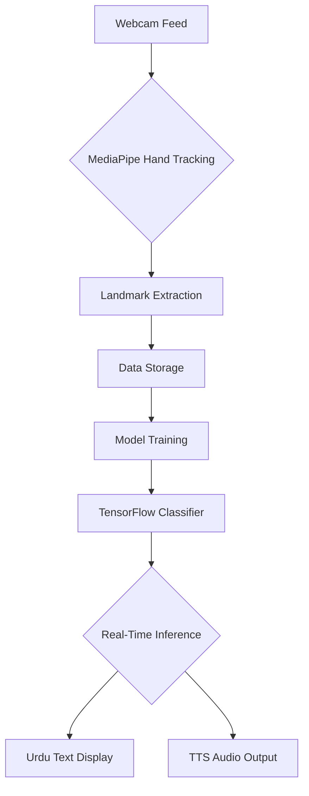

# 🖐️ Urdu Sign Language Translator - Real-Time Hand Gesture Recognition System

[](https://www.python.org/)
[](https://www.tensorflow.org/)
[](https://mediapipe.dev/)
[](https://en.wikipedia.org/wiki/Urdu)
[](LICENSE)

 
---

## 📌 Overview

This system enables real-time **Urdu Sign Language translation** using computer vision and machine learning. It captures hand gestures via webcam, processes them with MediaPipe, trains a TensorFlow model, and translates recognized signs into Urdu text with TTS support.

---

## 🧠 Core Components

### 1. **Data Collection (`collect.py`)**
- Captures hand gestures using webcam
- Uses MediaPipe for hand landmark detection
- Saves:
  - Raw images of gestures
  - Normalized landmark coordinates (x, y, z)
- Supports multi-gesture labeling

### 2. **Model Training (`training.py`)**
- Trains a dense neural network on collected data
- Input: 63-dimensional vectors (21 landmarks × 3 coordinates)
- Output: Probabilities for Urdu alphabet gestures
- Achieves ~95% accuracy with 30 epochs

### 3. **Live Translation (`live_translation.py`)**
- Real-time video processing pipeline
- Features:
  - Urdu text rendering with `arabic_reshaper`
  - Text-to-speech conversion (TTS)
  - Gesture smoothing with majority voting
  - Dynamic UI updates via Tkinter

---

## 🛠️ Technical Architecture



---

## 📦 Installation & Setup

### Prerequisites
- Python 3.8+
- TensorFlow 2.10+ (GPU recommended)
- MediaPipe 0.8.7
- OpenCV 4.5+
- Required packages:
  ```bash
  pip install mediapipe tensorflow opencv-python numpy gtts playsound arabic-reshaper python-bidi
  ```

### Dataset Preparation
1. Run data collector:
   ```bash
   python collect.py
   ```
2. Label gestures (e.g., "alif", "bay", "tay"):


---

## 🚀 Usage Guide

### 1. Data Collection
```bash
python collect.py
```
- Enter gesture names
- Press `s` to start recording
- Collect minimum 50 samples per gesture


### 2. Model Training
```bash
python training.py
```
- Automatically detects gestures from dataset
- Trains for 30 epochs
- Saves model to `model/gesture_model_enhanced.h5`

### 3. Live Translation
```bash
python live_translation.py
```


- Click "Start Recognition"
- Detected gestures appear in Urdu
- Use "Speak" for audio output
- "Clear All" resets the translation buffer

---

## 🔍 Code Highlights

### 📸 Landmark Extraction (from `collect.py`)
```python
def crop_hand_region(frame, hand_landmarks, padding=30):
    h, w, _ = frame.shape
    x_coords = [int(lm.x * w) for lm in hand_landmarks.landmark]
    y_coords = [int(lm.y * h) for lm in hand_landmarks.landmark]
    min_x = max(min(x_coords) - padding, 0)
    max_x = min(max(x_coords) + padding, w)
    min_y = max(min(y_coords) - padding, 0)
    max_y = min(max(y_coords) + padding, h)
    return frame[min_y:max_y, min_x:max_x]
```

### 🧠 Model Architecture (from `training.py`)
```python
model = tf.keras.Sequential([
    tf.keras.layers.Dense(128, activation='relu', input_shape=(63,)),
    tf.keras.layers.Dense(64, activation='relu'),
    tf.keras.layers.Dense(len(GESTURES), activation='softmax')
])
model.compile(optimizer='adam', loss='sparse_categorical_crossentropy', metrics=['accuracy'])
```

### 📜 Urdu Text Rendering (from `live_translation.py`)
```python
def join_urdu_letters(letters):
    urdu_word = "".join(letters)
    reshaped_word = arabic_reshaper.reshape(urdu_word)
    bidi_word = get_display(reshaped_word)
    return bidi_word
```

---

## 🤝 Contributing

1. Fork the repository
2. Create feature branch: `git checkout -b feature/new-gesture`
3. Implement your changes
4. Train model with new data
5. Submit Pull Request

---

## The Complete Project with code is available on request
```
https://github.com/faizanali49
```
